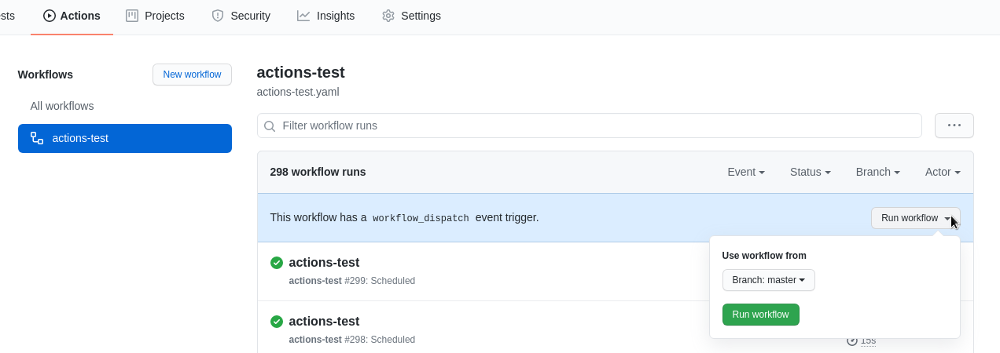
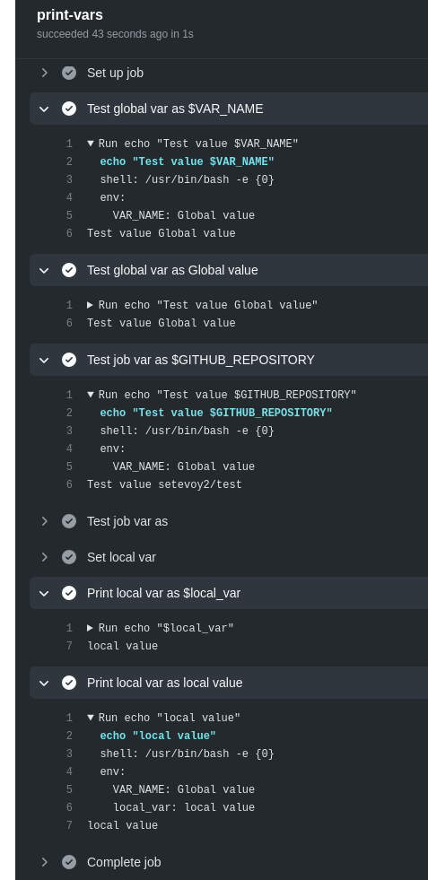
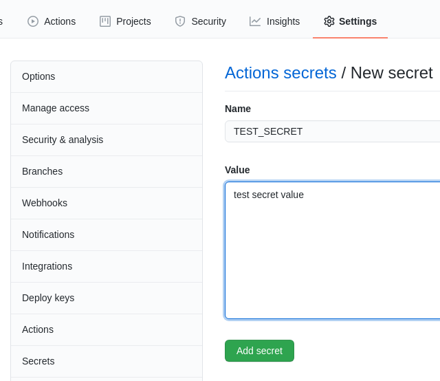

# Github Action

Github Actions(CI/CD) tricks that official documents didn't mention. This post including hints, tips, snippet, cheatsheet, troubleshooting, notes, how-to.

## Github Actions: an overview

In Actions, the build occurs as follows (see Introduction to GitHub Actions ):

- event (for example, a pull request or a commit to the repository, see the list here >>> ) triggers the start of the workflow , and the workflow contains jobs
- job contains a list of steps , and each step contains one or more actions
- actions are executed on the same runner , and several such actions can be executed within the same workflow at the same time

Main components:

- runner : the Github or self-hosted server that runs the job
- workflow : a described procedure that includes one or more jobs that is triggered by some event
- jobs : a set of steps that run on the same runner. If there are several jobs in one workflow, by default they are launched in parallel, but they can be configured to be executed in turn and depend on the results of each other's execution.
- steps : a task that executes commands or actions. Since steps in one job are performed on one runner, they can exchange data with each other.
- actions : main "executable blocks" - can represent a set of ready-made tasks, or execute ordinary commands

## Adding a workflow file

```bash
mkdir -p .github / workflows
```

```yaml
name: actions-test
on: [push]
jobs:
  print-hello:
    runs-on: ubuntu-latest
    steps:
      - run: echo "Hello, world"
```

## Events

In Events, you can describe rather complex conditions, according to which you will make a decision on the execution of a workflow.

```yaml
name: actions-test
on: 
  push:
    branches:
      - master
  pull_request:
    branches:
      - test-branch
```

### Scheduled events
```yaml
name: actions-test
on: 
  schedule:
    - cron: '* * * *'
```

### Manual start - workflow_dispatch
```yaml
name: actions-test
on: 
   workflow_dispatch
jobs:
  print-hello:
    runs-on: ubuntu-latest
    steps:
      - run: echo "Hello, world"
```
After that, a button will appear in Actions to start with a choice of a branch:



In addition, a set of input data can be added here, using inputswhich at runtime will be saved in the context github.eventand available as variables:

```yaml
name: actions-test
on: 
   workflow_dispatch:
     inputs:
       userName:
         description: "Username"
         required: true
         default: "test"
jobs:
  print-hello:
    runs-on: ubuntu-latest
    steps:
      - run: echo "Username: $ {{github.event.inputs.username}}"
      - run: echo "Actor's username: $ {{github.actor}}"
```
### Webhooks: create
In addition pushto the one we have already used, you can configure the start of the workflow for any event in the repository.

```yaml
name: actions-test
on: 
  create
jobs:
  print-hello:
    runs-on: ubuntu-latest
    steps:
      - run: |
          echo "Event name: $ {{github.event_name}}"
          echo "Actor's username: $ {{github.actor}}"
```

## Environment variables
Also, Github Actions supports working with environment variables.

```yaml
name: vars-test

on:
  push

env:
  VAR_NAME: "Global value"

jobs:
  print-vars:
    runs-on: ubuntu-latest
    steps:

      # using own varibales
      - name: "Test global var as $VAR_NAME"
        run: echo "Test value $VAR_NAME"

      - name: "Test global var as ${{ env.VAR_NAME }}"
        run: echo "Test value ${{ env.VAR_NAME }}"

      # using default variables
      - name: "Test job var as $GITHUB_REPOSITORY"
        run: echo "Test value $GITHUB_REPOSITORY"

      # this will be empty, as default variables are not in the context
      - name: "Test job var as ${{ env.GITHUB_REPOSITORY }}"
        run: echo "Test value ${{ env.GITHUB_REPOSITORY }}"

      # using 'dynamic' variables
      - name: "Set local var"
        run: echo "local_var=local value" >> $GITHUB_ENV

      - name: "Print local var as $local_var"
        run: echo "$local_var"

      - name: "Print local var as ${{ env.local_var }}"
        run: echo "${{ env.local_var }}"
```
And the result:



## Secrets
Secrets are added in repository settings> Secrets:



```yaml
name: actions-test

on: 
  push

env:
  TEST_ENV: ${{ secrets.TEST_SECRET }}

jobs:
  print-hello:
    runs-on: ubuntu-latest
    steps:
      - run: |
          echo "Test secret: ${{ secrets.TEST_SECRET }}"
          echo "Test secret: ${{ env.TEST_ENV }}"
```

Run:

